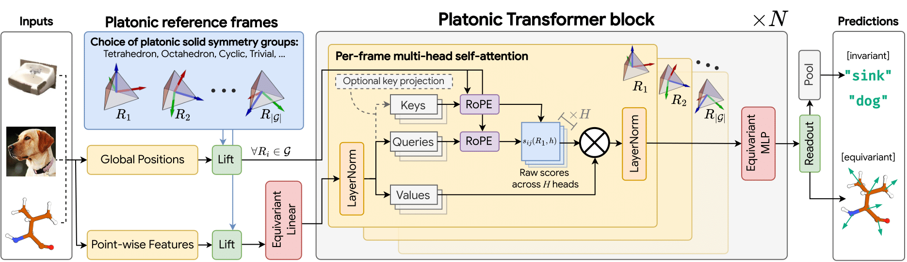

# Platonic Transformers: A Solid Choice For Equivariance

<p align="left">
  <a href="https://www.arxiv.org/abs/2510.03511"></a>
  <a href="https://pytorch.org/"></a>
  <a href="https://www.python.org/"></a>
  <a href="LICENSE"></a>
</p>


<a href="https://www.arxiv.org/abs/2510.03511"> Platonic Transformers: A Solid Choice For Equivariance</a> by <a href="https://niazoys.github.io">Mohammad Mohaiminul Islam</a>, <a href="https://rish-16.github.io/">Rishabh Anand</a>, <a href="https://amlab.science.uva.nl/people/DavidWessels/">David R. Wessels</a>, <a href="https://www.linkedin.com/in/friso-de-kruiff/">Friso de Kruiff</a>, <a href="https://pure.amsterdamumc.nl/en/persons/thijs-kuipers-3">Thijs P. Kuipers</a>, <a href="https://www.cs.yale.edu/homes/ying-rex/">Rex Ying</a>, <a href="https://qurai.amsterdam/researcher/clarisa-sanchez/">Clara I. Sánchez</a>, <a href="https://amlab.science.uva.nl/people/SharvareeVadgama/">Sharvaree Vadgama</a>, <a href="https://georg-bn.github.io/">Georg Bökman</a>, <a href="https://ebekkers.github.io/">Erik J. Bekkers</a>

Welcome to the Platonic Transformer project, where geometric group theory meets modern attention architectures 🌟. This repository contains research code for **Platonic Transformers**, a drop-in way to add geometric inductive biases to vanilla Transformers.


<p align="center">
  
</p>


## 📄 About the Paper

**Platonic Transformers** provide a drop-in method to build geometric inductive biases into the standard Transformer architecture, achieving approximate SE(2), E(2), SE(3), or E(3) equivariance at no additional computational cost. Our approach is based on:

- **Frame-relative attention.** Point-wise features are lifted to functions on a finite roto-reflection group; each group element acts as a reference frame, and attention (with RoPE) runs in parallel across frames with shared weights.
-   **Equivariance by design.** This yields **translation equivariance** (via RoPE) and **discrete roto-reflectional equivariance** (via weight sharing over the chosen group), without changing the attention mechanism.
-   **Dynamic group convolution.** Omitting softmax turns attention into a **linear-time, content-aware group convolution** equivalent.
-   **Cross-domain applicability.** Competitive results across CIFAR-10 (images), ScanObjectNN (3D), QM9 & OMol25 (molecular learning).


## ✨ Key Features

- 🔷 **Group-Equivariant Attention** — Based on the symmetries of Platonic solids (e.g., tetrahedron with 12, or octahedron 24 rotations).
- 🔄 **Unified Scalar/Vector I/O** — Equivariantly processes scalar and vector features as both input and output.
- 🔳 **Generalizes Standard Transformers** — The standard Transformer architecture is recovered by choosing the trivial symmetry group.
- 🎯 **Multiple Benchmarks** — CIFAR-10, QM9 regression, ScanObjectNN, and OMol25.
- ⚡ **Linear-Time Variant** — Dynamic group convolution by dropping softmax.
- 🛠️ **Easy to Use** — Unified `meta_main.py` entry point for all datasets.


## 🚀 Quick Start

```bash
# Clone and setup
git clone https://github.com/niazoys/PlatonicTransformer.git
cd PlatonicTransformer
chmod +x setup.sh && ./setup.sh
source .venv/bin/activate


# Train on CIFAR-10 (loads configs/cifar10_deit.yaml)
python meta_main.py cifar10 --batch_size 256 --lr 8e-4

# Train on QM9 molecular properties (loads configs/qm9_regr.yaml)
python meta_main.py qm9_regr --target mu --batch_size 96

# Train on OMol energy/force regression (loads configs/omol.yaml)
python meta_main.py omol --predict_forces --force_weight 100
```

## 📂 Repository Structure
```
.
├── meta_main.py             # 🎯 Unified entry point for all datasets
├── configs/                 # Dataset-specific YAML configs
├── data/                    # Downloaded datasets and artifacts
├── mains/                   # Dataset-specific training scripts
│   ├── main_cifar10.py
│   ├── main_omol.py
│   └── main_qm9_regr.py
├── platonic_transformers/
│   ├── datasets/            # Dataset loaders for supported benchmarks
│   ├── models/              # Platonic Transformer building blocks
│   │   ├── block.py         # Core PlatonicBlock (attention + feedforward)
│   │   ├── conv.py          # Group convolution utilities
│   │   ├── groups.py        # Symmetry group definitions for Platonic solids
│   │   ├── io.py            # Lifting, pooling, dense/sparse utilities
│   │   ├── linear.py        # Equivariant linear projections
│   │   └── platoformer.py   # Full PlatonicTransformer module
│   └── utils                # Config loader and helper utilities
├── pyproject.toml           # Project configuration file
├── requirements.txt         # Python dependencies
├── setup.sh                 # Environment setup script
```


## 🔧 Installation

### Prerequisites
- Python 3.12+
- CUDA 12.1+ (for GPU support)
- PyTorch 2.3+

### Setup

1. **Clone the repository** and install system dependencies if needed.
2. **Create the environment:**
   ```bash
   chmod +x setup.sh
   ./setup.sh
   ```
3. **Activate the environment:**
   ```bash
   source .venv/bin/activate
   ```
4. **Authenticate with Weights & Biases** (optional, for experiment tracking):
   ```bash
   wandb login
   ```


## 🎮 Usage

### Available Datasets

| Dataset | Task | Description |
|---------|------|-------------|
| `cifar10` | Image Classification | CIFAR-10 with patch-based point cloud representation |
| `qm9_regr` | Molecular Property Prediction | QM9 quantum chemistry dataset |
| `omol` | Molecular Learning | Open Molecular Learning dataset |
<!-- | `scanobjectnn` | 3D Object Classification | Real-world 3D scanned objects | (temporarily disabled) -->

### Unified Entry Point 

Use `meta_main.py` to run any dataset training script. Each dataset automatically loads its YAML configuration from `configs/<dataset>.yaml`. Pass `--config path/to/custom.yaml` to replace the entire config file, and layer additional CLI flags on top for quick tweaks:

```bash
# List available datasets
python meta_main.py --help

# Get help for a specific dataset (shows all available arguments)
# python meta_main.py scanobjectnn --help  # (temporarily disabled)
python meta_main.py qm9_regr --help

# Run training
# Swap in a different config
python meta_main.py cifar10 --config configs/cifar10_small.yaml

# Override individual keys from the active config
# python meta_main.py scanobjectnn --epochs 500 --batch_size 128  # (temporarily disabled)
python meta_main.py cifar10 --batch_size 256 --lr 8e-4
python meta_main.py qm9_regr --target mu --batch_size 96
python meta_main.py omol --predict_forces --force_weight 100
```

### Direct Script Execution (Alternative)

You can also run scripts directly from the `mains/` directory:

```bash
python mains/main_cifar10.py --batch_size 256 --lr 8e-4
python mains/main_qm9_regr.py --target alpha --batch_size 64
python mains/main_omol.py --predict_forces --force_weight 100
```

### Common Configuration Flags

**Model Architecture:**
- `--solid_name` - Platonic solid: `{tetrahedron, octahedron, icosahedron, trivial_3}` (default: octahedron)
- `--hidden_dim` - Hidden dimension size
- `--layers` - Number of transformer layers
- `--num_heads` - Number of attention heads

  **Note on Hidden Dimension:** For the model to work correctly, `--hidden_dim` must be divisible by both the order of the chosen group (`|G|`) and the specified `--num_heads`. The internal dimensions for attention are calculated automatically from these values.

  **Example:**
  Let's say you use `--solid_name tetrahedron`, `--hidden_dim 768`, and `--num_heads 48`.
  - The `tetrahedron` group has an order `|G| = 12`.
  - The feature dimension per group element is `hidden_dim / |G| = 768 / 12 = 64`.
  - The dimension of each attention head is `hidden_dim / num_heads = 768 / 48 = 16`.
  - The number of independent heads applied to each group element's features is `(hidden_dim / |G|) / (hidden_dim / num_heads) = 64 / 16 = 4`.
  
  This means the model will run 4 attention heads per group element, where each head has a dimension of 16.

**Positional Encodings:**
- `--rope_sigma` - Sigma for Rotational Positional Encoding (RoPE)
- `--ape_sigma` - Sigma for Absolute Positional Encoding (APE)
- `--freq_init` - Frequency initialization: `{random, spiral}`

**Training:**
- `--epochs` - Number of training epochs
- `--batch_size` - Training batch size
- `--lr` - Learning rate
- `--weight_decay` - Weight decay for optimizer
- `--seed` - Random seed for reproducibility

**System:**
- `--gpus` - Number of GPUs to use
- `--num_workers` - Number of data loading workers
- `--log` - Enable/disable WandB logging

💡 **Tip:** Start with smaller `--hidden_dim` (e.g., 64) and fewer `--layers` to validate pipelines quickly!


## 🧠 Model Architecture

**Platonic Transformers** leverage the rotational symmetries of Platonic solids to enforce SE(3)-equivariance in attention mechanisms. The architecture is implemented in `platonic_transformers/models/platoformer/`.

### Core Components

- **Lifting** (`io.py`) - Maps scalar and vector node features to group-aligned channels
- **Attention Blocks** (`block.py`) - Stacked `PlatonicBlock` layers with group-aware attention and equivariant MLPs
- **Equivariant Convolutions** (`conv.py`) - SE(3)-equivariant convolution layers
- **Group Theory** (`groups.py`) - Platonic solid symmetry group implementations
- **Positional Encodings** - Dual encoding strategy:
  - **RoPE** (`rope.py`) - Rotational Positional Encoding for relative positions
  - **APE** (`ape.py`) - Absolute Positional Encoding for global context
- **Readout** (`io.py`) - Separate scalar/vector readouts with pooling for graph or node-level predictions

### Supported Platonic Solids

| CLI label(s)                         | Dim | Type                              | Order (\|G\|)                                | Notes / Typical use                                                                 |
|-------------------------------------|-----|------------------------------------|---------------------------------------------|--------------------------------------------------------------------------------------|
| `trivial`                           | 3   | Identity only                      | 1                                           | 3D baseline (no rotational bias); translation handled via RoPE.                     |
| `trivial_n` (n = 2…10)              | n   | Identity only                      | 1                                           | Identity-only group in chosen dimension; e.g., `trivial_2`, `trivial_3`, …          |
| `tetrahedron`                       | 3   | Platonic rotational                | 12                                          | **Default**: lightweight 3D rotational equivariance; fewer frames/compute.          |
| `octahedron`                        | 3   | Platonic rotational                | 24                                          | Higher capacity than tetra; balanced accuracy/compute.                              |
| `icosahedron`                       | 3   | Platonic rotational                | 60                                          | Highest rotational expressivity; most frames/compute.                               |
| `octahedron_reflections`            | 3   | Axis-aligned reflections (x/y/z)   | 8                                           | Independent flips about x, y, z; useful when parity (mirror) cues matter.           |
| `cyclic_n` (n = 2…20)               | 2   | Rotation-only                      | \(n\)                                       | 2D discrete rotations; e.g., `cyclic_4`, `cyclic_6`.                                |
| `dihedral_n` (n = 2…20)             | 2   | Rotations + reflections            | \(2n\)                                      | 2D rotations **and** mirror symmetry; e.g., `dihedral_4`, `dihedral_6`.             |
| `flop_2d_<axis>` (axis = 1, 2)      | 2   | Single-axis reflection             | 2                                           | Axis 1: reflect across x-axis (flip y); Axis 2: reflect across y-axis (flip x).    |
| `flop_3d_<axis>` (axis = 1, 2, 3)   | 3   | Single-axis reflection             | 2                                           | Axis 1: YZ-plane (flip x); Axis 2: XZ-plane (flip y); Axis 3: XY-plane (flip z).   |

**Examples**
```bash
# Default (3D rotational, 12 frames)
python meta_main.py omol --solid_name tetrahedron ...

# 2D rotation-only / rotations+reflections
python meta_main.py cifar10 --solid_name cyclic_4 ...
python meta_main.py cifar10 --solid_name dihedral_6 ...
```


## 📊 Datasets

### CIFAR-10 (`cifar10`)
- **Task:** Image Classification (10 classes)
- **Representation:** Patches converted to point clouds
- **Key Args:** `--patch_size`, `--num_points_per_patch`

### QM9 (`qm9_regr`)
- **Task:** Molecular Property Regression
- **Properties:** 12 quantum chemical properties (e.g., dipole moment μ, HOMO-LUMO gap)
- **Key Args:** `--target {mu, alpha, homo, lumo, ...}`, `--use_bonds`

<!-- ### ScanObjectNN (`scanobjectnn`) (temporarily disabled)
- **Task:** 3D Object Classification (real-world scans)
- **Variants:** PB_T50_RS (hardest variant with rotation and perturbations)
- **Key Args:** `--num_points`, `--use_normals`
-->

### Open Molecular (`omol`)
- **Task:** Molecular Property Prediction with LMDB backend
- **Features:** Large-scale molecular learning with atomic embeddings
- **Key Args:** `--radius`, `--max_neighbors`


## 📖 Citation

If you use Platonic Transformers in your research, please cite:

```bibtex
@misc{islam2025platonictransformerssolidchoice,
      title={Platonic Transformers: A Solid Choice For Equivariance}, 
      author={Mohammad Mohaiminul Islam and Rishabh Anand and David R. Wessels and Friso de Kruiff and Thijs P. Kuipers and Rex Ying and Clara I. Sánchez and Sharvaree Vadgama and Georg Bökman and Erik J. Bekkers},
      year={2025},
      eprint={2510.03511},
      archivePrefix={arXiv},
      primaryClass={cs.CV},
      url={https://arxiv.org/abs/2510.03511}, 
}
```


## 📝 License

This project is licensed under the MIT License - see the LICENSE file for details.


## 🤝 Contributing

Contributions are welcome! Please feel free to submit a Pull Request. For major changes, please open an issue first to discuss what you would like to change.


## 📬 Contact
For questions or issues:
- Open an issue on GitHub
- Email us [here](mailto:m.m.islam@uva.nl,e.j.bekkers@uva.nl)


<!-- *🚀🚀🚀Happy Experimenting! 🚀🚀🚀* -->


